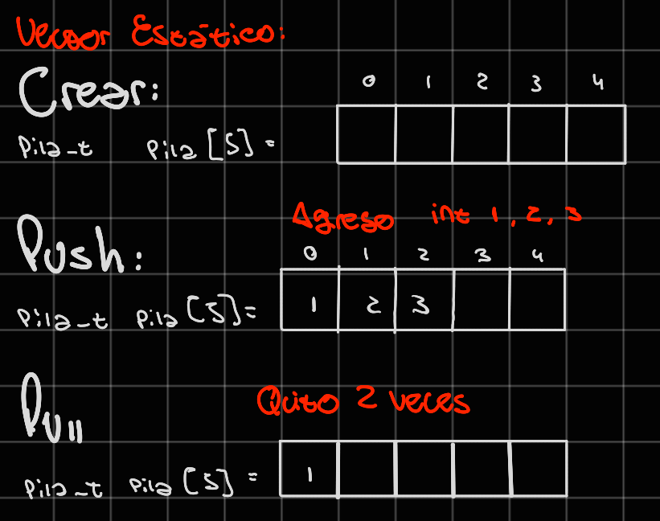

<div align="right">

</div>

# NOMBRE TP/TDA

## Repositorio de (Nombre Apellido) - (Padrón) - (Mail)

- Para compilar:

```bash
línea de compilación
```

- Para ejecutar:

```bash
línea de ejecución
```

- Para ejecutar con valgrind:

```bash
línea con valgrind
```

---

## Funcionamiento

Explicación de cómo funcionan las estructuras desarrolladas en el TP y el funcionamiento general del mismo.

Aclarar en esta parte todas las decisiones que se tomaron al realizar el TP, cosas que no se aclaren en el enunciado, fragmentos de código que necesiten explicación extra, etc.

Incluír **EN TODOS LOS TPS** los diagramas relevantes al problema (mayormente diagramas de memoria para explicar las estructuras, pero se pueden utilizar otros diagramas si es necesario).

### Por ejemplo:

El programa funciona abriendo el archivo pasado como parámetro y leyendolo línea por línea. Por cada línea crea un registro e intenta agregarlo al vector. La función de lectura intenta leer todo el archivo o hasta encontrar el primer error. Devuelve un vector con todos los registros creados.

<div align="center">

</div>

En el archivo `sarasa.c` la función `funcion1` utiliza `realloc` para agrandar la zona de memoria utilizada para conquistar el mundo. El resultado de `realloc` lo guardo en una variable auxiliar para no perder el puntero original en caso de error:

```c
int *vector = realloc(vector_original, (n+1)*sizeof(int));

if(vector == NULL)
    return -1;
vector_original = vector;
```

<div align="center">

</div>

---

## Respuestas a las preguntas teóricas

- ¿Qué es una lista/pila/cola? Explicar con diagramas.
  Una lista es un tipo de TDA, que representa una sucesión de elementos ordenados. La misma se puede implementar de diferentes maneras, de las cuales se destacan tres: vector estático, vector dinámico y nodos simple o doblemente enlazados. Igualmente, una pila y una cola son tipos de lista, cuyos funcionamientos generales diferencian en algunas cuestiones con el de una lista.

Una lista permite tener una sucesión de elementos, y aplicar operaciones en torno a la misma cómo: crearla, insertar, eliminar y acceder a un elemento en cualquier posición de la lista, verificar si está vacía, verificar la cantidad de elementos que tiene, destruirla, entre otras.

Mientras tanto, una pila carece de algunas de estas operaciones. Visualmente una pila se podría representar como un conjunto de libros apilados uno encima del otro. En cuanto a las operaciones que no están presentes en la pila se encuentran por ejemplo insertar, eliminar y acceder a elementos en cualquier posición de la lista. En este caso, solo se puede apilar, desapilar y acceder al último elemento de la pila, el tope, que sería el libro de más arriba. De este modo, se dice que su manejo es del tipo FILO: "First In, Last Out".

Y por último una cola se podría representar como la fila que se hace para pagar en un supermercado. Las operaciones que cambian en este caso son: insertar, que únicamente se puede encolar un elemento en el final de la lista, quitar, que sólo se permite desencolar un elemento en el principio de la lista, y acceder al elemento, donde sólo se permite acceder al primer elemento de la lista, como quien está pasando sus productos por la caja del supermercado. Así, la cola tiene un manejo del tipo FIFO: "First In, Fist Out".

Una lista se vería representada con el siguiente diagrama:


Una pila se vería representada con el siguiente diagrama:




Una cola se vería representada con el siguiente diagrama:


- Explica y analiza las diferencias de complejidad entre las implementaciones de lista simplemente enlazada, doblemente enlazada y vector dinámico para las operaciones:

En principio, la complejidad de las funciones en cada implementación de lista, dependerá de las diferentes maneras en las que se desarrolló cada algoritmo en su totalidad, la manera en que se define el stuct de lista, entre otras cuestiones.

- Insertar/obtener/eliminar al inicio
  Lista simplemente enlazada: en esta implementación, si se tiene en cuenta que dentro del struct lista existe un puntero al primer nodo de la lista, se asegura una complejidad de O(1), ya que las instrucciones del algoritmo consisten en asignasiones que dependen de la operación a reailzar, pero que en fin tienen complejidad O(1).

  Lista doblemente enlazada: con esta implementación el proceso es similar a aquel realizado en una lista simplemente enlazada. Teniendo en cuenta que en el desarrollo del algoritmo, se incluyó en el struct lista un puntero al primer elemento de la lista, la operación en cuestión tiene una complejidad de O(1), ya que las instrucciones a realizar consisten en asignasiones que dependen de la operación a realizar, que en fin tienen complejidad O(1).

  Vector dinámico: si se tiene un vector dinámico lineal, obtener el primer elemento de la lista conlleva una complejidad de O(1), al poder acceder fácilmente al mismo mediante su indice. En cuanto a eliminar e insertar el elemento al inicio, dichas operaciones conllevan una complejidad O(n), ya que en ambos casos es necesario recorrer todos los elementos del vector, sea para moverlos una posición atrás para poder insertar el elemento al inicio o para mover todos los elementos una posición adelante en el vector en caso de haberlo eliminado.

- Insertar/obtener/eliminar al final
  Lista simplemente enlazada: al igual que haciéndolo al inicio, si se tiene en cuenta que dentro del struct lista existe un puntero al nodo final de la lista, obtener el elemento del final tiene una complejidad de O(1), ya que las instrucciones a realizar son acceder a dicho nodo y devolver el elemento. En caso de insertar un elemento al final, ocupa una complejidad de O(1), ya que teniendo el puntero al último elemento, las instrucciones a realizar son la asignación del puntero siguiente del mismo al nodo a insertar, y la inicialización del último. Mientras tanto, al eliminar un elemento al final, inevitablemente se tendría que iterar hasta el nodo previo en la lista, para poder hacer la correcta asignación de los punteros siguiente de dicho nodo. Por lo tanto, esta operacion tiene complejidad O(n).

  Lista doblemente enlazada: en este caso, teniendo en cuenta que en cada nodo se tiene un puntero al anterior, las tres operaciones resultan tener complejidad O(1), ya que tanto en obtener como en insertar las instrucciones son la mismas que las explicadas en el caso de una lista simplemente enlazada, y además al eliminar el nodo al final, la asignasión de punteros del anterior se realiza utilizando el puntero disponible en el nodo final al anterior. Por lo tanto, en este caso las tres operaciones conllevan una complejidad de O(1).

  Vector dinámico: en este caso, si se tiene en cuenta que el realloc, a realizar a la hora de agrandar el tamaño del vector en 1 al insertar, no falla, las complejidades de las opereaciones en cuestión resultan O(1), ya que todas sus posiciones son fácilmente accesibles mediante el índice del vector y el resto de instrucciones a realizar son asignaciones o free. Si se tiene en cuenta que el realloc podría fallar, en ese caso se deben mover todos los elementos del vector a una nueva dirección de memoria, por lo que la complejidad escalaría a O(n).

- Insertar/obtener/eliminar al medio
  Lista simplemente enlazada: en el caso de realizar estas operaciones en los nodos del medio de la lista, se toma en cuenta que se deberá iterar N-veces para llegar a dicha posición, o a la anterior en caso de tener que eliminar. Por esto, el hecho de que una vez ya iterado hasta el nodo en cuestión, el resto de las instrucciones a realizar sean de complejidad O(1) por se asignaciones, la complejidad dependerá de ese N al que se debe llegar. Por lo tanto, la complejidad de las tres operaciones en cuestión resulta O(n).

  Lista doblemente enlazada: este caso resulta similar al de una lista simplemente enlazada. Igualmente se toma en cuenta que se realizarán (N sobre dos)-iteraciones hasta el nodo en cuestión, ya que se puede empezar a iterar desde el inicio o fin y como peor caso el nodo está en el medio. Esto en teoría, sí acorta la cantidad de iteraciones a realizar, pero al ser N/2 un tipo kN, se dice que para reailzar estas operaciones, se tiene una complejidad de O(n).

  Vector dinámico: para el caso de obtener en el medio, tendría una complejidad de O(1), ya que se puede acceder a dichos elementos mediante el índice del vector. Mientras que para las operaciones de insertar y eliminar, sería necesario mover los elementos posteriores a la posición a eliminar o insertar dentro del vector. Teniendo en cuenta que se toma en el peor de los casos que se hacen N-iteraciones para mover dichos elementos, la complejidad de estas operaciones resulta O(n).

- Explica la complejidad de las operaciones implementadas en tu trabajo para la pila y la cola.
